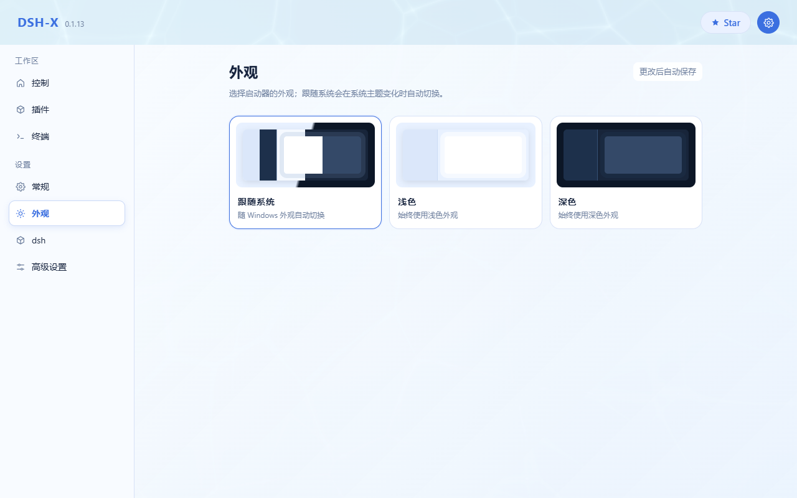

<p align="center">
  
</p>

<p align="center">
  <a href="https://yyh-001.github.io/DSH-X/">主页</a>
  ·
  <a href="https://github.com/yyh-001/DSH-X/releases/latest/download/DSH-Setup.exe">下载</a>
  ·
  <a href="https://github.com/yyh-001/DSH-X">Star</a>
</p>

DeepSeek Harness 轻量 Windows 启动器。选一个版本，在系统浏览器中启动 DSH Web。

> [!IMPORTANT]
> **DSH-X 启动的是 DeepSeek Harness 官方原版 Web 页面，不是桌面端。**  
> 它只负责版本安装、启动和插件管理，不内嵌 WebView，不修改或重做 DSH 的网页界面。DSH-X 本身是社区开源项目，并非 DeepSeek 官方产品。

> [!NOTE]
> **这是 [yyh-001/DSH-X](https://github.com/yyh-001/DSH-X) 的 macOS 分支，社区移植，不是 DeepSeek 官方产品。**
> 管理页是一个本地应用，DSH 页面在系统浏览器里打开。下载、环境要求和与上游的差异见 **[MACOS.md](MACOS.md)**。

## 功能

- **选版本即用**：启动 / 停止 / 重启 / 更新 / 卸载
- **插件页**：列出已装插件一键开关
- **兼容模式**：启动失败按报错自动禁用出问题的插件（可一键恢复）；启动后自检页面引用的客户端插件包，管理页给出结论（区分实例问题和旧标签页）
- **启动加速**：在 bundle 合成处挂等价快实现（约省 1–2 秒），dsh 升级后自动跳过
- **插件跟官方走**：数据在用户目录 `.dsh`，换版本不用重装插件
- **更新留旧版**：只保留最新的和最近装的一个（回退够用），更旧的装完自动清理
- **托盘常驻**：关网页不退出，界面走系统浏览器
- **自带 Node / npm**：安装包含便携 `node.exe` 与 npm 10，镜像源 npmmirror
- **同时只跑一个版本**：避免不同版本争用端口和数据
- **首次安装可预装市场**：可自动安装 `dshmarket`

交流 / 反馈：**QQ 群 [993579665](https://qm.qq.com/q/7AD2g70HqS)**（[点击加入](https://qm.qq.com/q/7AD2g70HqS)）

## 界面预览

<p align="center">
  
</p>

<p align="center">
  
</p>

<p align="center">
  
</p>

## 下载

| 系统 | 安装包 | 说明 |
| --- | --- | --- |
| macOS 12+，Apple Silicon | [DSH-X-0.1.13-mac.dmg](https://github.com/carrotluo5/DSH-X/releases/latest/download/DSH-X-0.1.13-mac.dmg) | 打开后把 DSH-X 拖进「应用程序」 |
| Windows | [DSH-Setup.exe](https://github.com/yyh-001/DSH-X/releases/latest/download/DSH-Setup.exe) | 上游原版安装包 |

macOS 需要本机另装 **Node.js 22.19 或更新**（应用不内置 Node）。装、卸插件还需要 `pnpm`。第一次打开如果提示无法验证开发者，右键 DSH-X → 打开。Intel Mac 跑不了这一份。

## 使用

Windows 安装后从桌面打开 **DSH-X**；macOS 从启动台或「应用程序」打开。管理页地址默认 `http://127.0.0.1:3780/`（设置页可改端口，改完重启启动器生效）。点「启动」后，DSH 页面用系统浏览器打开，默认端口 3080。

## 开发

需要本机 Node.js 22.18+（官方 DSH：`^22.19.0 || >=24`）。

```sh
npm install
npm start
```

只起网页：`npm run server`。

## 打包

Windows 需要 Rust 与 Inno Setup 6（没有会尝试下载）：

```sh
npm run dist
```

- `release/DSH/`：便携目录
- `release/DSH-Setup.exe`：安装包（默认 `%LOCALAPPDATA%\Programs\DSH`）

macOS 只需要 Command Line Tools：

```sh
npm run macos        # release/DSH-X.app
npm run macos:dmg    # 额外生成 dmg
```
